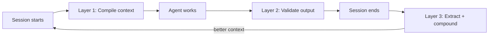

<div align="center">

# AgentOps

[](https://github.com/boshu2/agentops/actions/workflows/validate.yml)
[](https://github.com/boshu2/agentops/actions/workflows/nightly.yml)
[](https://github.com/boshu2/agentops/stargazers)

**Context compiler for coding agents. Assembles, tests, and delivers the right context across Claude, Codex, Cursor, and OpenCode.**

AgentOps gives agents a shared `ao` control plane, lifecycle hooks, validation gates, and a repo-owned `.agents/` corpus so work survives chat windows and vendor boundaries.

[Install](#install) · [Quick Start](#quick-start) · [Cross-Vendor](#agentops-is-the-cross-vendor-operating-layer) · [Why DevOps?](#why-devops) · [Skills](#skills) · [CLI](#the-ao-cli) · [Doctrine](https://12factoragentops.com) · [Docs](docs/documentation-index.md)

</div>

---

## Install

Pick the runtime you use.

**Claude Code**

```bash
claude plugin marketplace add boshu2/agentops
claude plugin install agentops@agentops-marketplace
```

**Codex CLI on macOS, Linux, or WSL**

```bash
curl -fsSL https://raw.githubusercontent.com/boshu2/agentops/main/scripts/install-codex.sh | bash
```

**Codex CLI on Windows PowerShell**

```powershell
irm https://raw.githubusercontent.com/boshu2/agentops/main/scripts/install-codex.ps1 | iex
```

**OpenCode**

```bash
curl -fsSL https://raw.githubusercontent.com/boshu2/agentops/main/scripts/install-opencode.sh | bash
```

**Other skills-compatible agents**

```bash
npx skills@latest add boshu2/agentops --cursor -g
```

Restart your agent after install. Then type `/quickstart` in your agent chat.

The `ao` CLI is optional, but recommended. It unlocks repo-native bookkeeping, retrieval, health checks, and terminal workflows.

**macOS**

```bash
brew tap boshu2/agentops https://github.com/boshu2/homebrew-agentops
brew install agentops
ao version
```

**Windows PowerShell**

```powershell
irm https://raw.githubusercontent.com/boshu2/agentops/main/scripts/install-ao.ps1 | iex
ao version
```

You can also install the CLI from [release binaries](https://github.com/boshu2/agentops/releases) or [build from source](cli/README.md).

| Concern | Answer |
|---------|--------|
| What it touches | Installs skills globally and registers runtime hooks when requested; agent work writes local bookkeeping to `.agents/` |
| Source code changes | None during install |
| Network behavior | Install and update paths fetch from GitHub; repo artifacts stay local unless you choose external tools or remote model runtimes |
| Telemetry | None required |
| Permission surface | Skills can run shell commands and read or write repo files during agent work, so install where you want agents to operate |
| Reversible | Remove the installed skill directories, delete `.agents/`, and remove hook entries from your runtime settings |

Troubleshooting: [docs/troubleshooting.md](docs/troubleshooting.md) · Configuration: [docs/ENV-VARS.md](docs/ENV-VARS.md)

---

## What AgentOps Gives You

Three layers. Each solves a different problem. All three compound.

| Layer | Problem | What changes |
|-------|---------|--------------|
| **Context Compiler** | Every session starts from zero | `ao inject` delivers decay-ranked knowledge. `ao context assemble` builds phase-scoped packets. 71 skills load automatically via hooks. *Your agent starts loaded, not cold.* |
| **Validation Gates** | Agents ship confident garbage | `/pre-mortem`, `/vibe`, `/council` — multi-model consensus validates plans before build and code before commit. Gates block, not advise. *Three fresh judges catch what one agent can't.* |
| **Knowledge Flywheel** | Lessons disappear between sessions | `/forge` extracts learnings. `ao flywheel close-loop` scores and promotes. `/evolve` fixes the worst gap autonomously. `/dream` compounds overnight. *Session 15 starts with everything session 1 learned.* |



All state lives in local `.agents/` — plain text you can grep, diff, and review. Zero telemetry. Zero cloud dependency. Runtime-neutral across Claude Code, Codex CLI, and OpenCode.

### The three gaps (proof contract)

The three layers close three failure modes most agent setups don't even name:

| Gap | Where the loop breaks | Closed by |
|-----|-----------------------|-----------|
| **Judgment** | Plan looks coherent. Code passes tests. Both miss the edge case. | Layer 2: `/pre-mortem` · `/vibe` · `/council` |
| **Durable Learning** | Auth bug fixed Monday. Same bug returns Wednesday. | Layer 3: `/forge` · `ao flywheel` · `ao inject` |
| **Loop Closure** | Code lands. No lesson extracted. Next session re-learns from scratch. | Layer 3→1: `/evolve` · finding compiler · `/dream` |

Each factor in the [12-factor doctrine](https://12factoragentops.com) closes one or more of these gaps. Full contract: [docs/context-lifecycle.md](docs/context-lifecycle.md).

---

## Why DevOps?

DevOps proved that disciplined systems around indeterministic workers produce reliable output. SRE proved it again with SLOs and error budgets. Kubernetes proved it for infrastructure with control loops. Coding agents are the next indeterministic worker class. Same playbook. New substrate.

DevOps had the SDLC — the infinity loop that made software delivery an engineering discipline. Coding agents need an equivalent: the **Context Development Life Cycle (CDLC)**. Every SDLC phase has a context counterpart. AgentOps implements all of them.

| SDLC | CDLC | AgentOps surface |
|------|------|------------------|
| **Plan** | **Generate** | `/research`, `/plan`, SKILL.md authoring |
| **Code + Build** | **Compile** | `ao context assemble`, `ao inject`, decay-ranked retrieval |
| **Test** | **Test** | `/pre-mortem`, `/vibe`, `/council`, `ao eval run` |
| **Release** | **Distribute** | Skills registry, `/converter`, cross-runtime export |
| **Deploy** | **Deliver** | `SessionStart` hooks, `ao inject --for=<skill>` |
| **Operate** | **Observe** | Citation tracking, quality signals, session-outcome |
| **Monitor → Plan** | **Adapt** | MemRL feedback, `/forge`, `/evolve`, `/dream` |

LLMs are engines. Context is fuel. You can't tune the engine — that's the model vendor's job. But you can engineer the fuel. The CDLC is how.

Each generation of software practice gave teams a durable artifact: the wiki, the runbook, the postmortem, the toil budget. AgentOps gives your agents the same kind of artifact — **the corpus**. A typed, versioned, agent-readable knowledge store maintained alongside the code. The model stays the same. The corpus compounds.

> The harness layer commoditizes. Memory primitives, learning loops, validation gates — frontier vendors will ship them natively. What stays yours is the corpus. AgentOps is the bridge tool that helps you build that moat now. See [PRODUCT.md](PRODUCT.md) for the full thesis.

Full CDLC treatment: [docs/cdlc.md](docs/cdlc.md). Theoretical foundations: [docs/the-science.md](docs/the-science.md) and [docs/brownian-ratchet.md](docs/brownian-ratchet.md).

---

## Quick Start

Inside a repo, use the path that matches what you are trying to do.

| Path | Run | Done when |
|------|-----|-----------|
| **First repo setup** | `ao quick-start`, then `/quickstart` | AgentOps reports repo readiness and a next action |
| **First validated change** | `/rpi "a small goal"` | Discovery, implementation, validation, and learning closeout leave evidence in `.agents/` |
| **Review something now** | `/council validate this PR` or `/vibe recent` | You get a consolidated verdict and an evidence record in `.agents/` before shipping |

New project? Use the guided CLI seed first:

```bash
ao quick-start     # Canonical
ao quickstart      # Stable alias
```

That command applies the repeatable core seed: `.agents/`, `GOALS.md`,
AgentOps instructions, starter knowledge, and readiness guidance. Use
`/bootstrap` after that when you want the product/operations layer:
`PRODUCT.md`, `README.md`, `PROGRAM.md`/`AUTODEV.md`, and optional hooks.

Already installed? Ask your agent for the next action:

```text
/quickstart
```

If you installed the CLI, check your local setup:

```bash
ao doctor
ao demo
```

Full catalog: [docs/SKILLS.md](docs/SKILLS.md) · Unsure what to run? [Skill Router](docs/SKILL-ROUTER.md)

---

## See It Work

**One command: validate a PR across vendors**

```text
> /council --mixed validate this PR

[council] evidence packet sealed -> 6 judges across 2 runtimes
[claude/judge-1] WARN - rate limiting missing on /login endpoint
[claude/judge-2] PASS - Redis integration follows middleware pattern
[codex/judge-1]  WARN - token bucket refill lacks jitter under burst
[codex/judge-2]  PASS - backoff bounds match retry policy
Consensus: WARN - fix /login rate limit and add refill jitter before shipping
Recorded: .agents/council/<run-id>/verdict.md
```

**Full loop: research through post-mortem**

```text
> /rpi "add retry backoff to rate limiter"

[research]    Found 3 prior learnings on rate limiting
[plan]        2 issues, 1 wave
[pre-mortem]  Council validates the plan
[crank]       Executes the scoped work
[vibe]        Council validates the code
[post-mortem] Captures new learnings in .agents/
[flywheel]    Next session starts with better context
```

The point is not a bigger prompt. The point is a repo that remembers what worked.

---

## Skills

Every skill works alone. Flows compose them when you want more structure.

| Skill | Use it when |
|-------|-------------|
| `/quickstart` | You want the fastest setup check and next action |
| `/council` | You want independent judges — optionally across Claude and Codex — to evaluate one evidence packet and return a consolidated verdict |
| `/research` | You need codebase context and prior learnings before changing code |
| `/pre-mortem` | You want to pressure-test a plan before implementation |
| `/implement` | You want one scoped task built and validated |
| `/rpi` | You want discovery, build, validation, and bookkeeping in one flow |
| `/vibe` | You want a code-quality and risk review before shipping |
| `/evolve` | You want a goal-driven improvement loop with regression gates |
| `/dream` | You want overnight knowledge compounding that never mutates source code |

<details>
<summary><b>Full catalog</b> - validation, flows, bookkeeping, and session skills</summary>

**Validation:** `/council` · `/vibe` · `/pre-mortem` · `/post-mortem`

**Flows:** `/research` · `/plan` · `/implement` · `/crank` · `/swarm` · `/rpi` · `/evolve`

**Bookkeeping:** `/retro` · `/forge` · `/flywheel` · `/compile`

**Session:** `/handoff` · `/recover` · `/status` · `/trace` · `/provenance` · `/dream`

**Product:** `/product` · `/goals` · `/release` · `/readme` · `/doc`

**Utility:** `/brainstorm` · `/bug-hunt` · `/complexity` · `/scaffold` · `/push`

Full reference: [docs/SKILLS.md](docs/SKILLS.md)

</details>

<details>
<summary><b>Cross-runtime orchestration</b> - mix Claude, Codex, Cursor, and OpenCode</summary>

Multi-runtime, one workflow. The same validation, research, delivery, and bookkeeping flows run whether the active worker is Claude Code, Codex, Cursor, or OpenCode.

One runtime leads a session. Another reviews the result. A third handles focused implementation. Adapters are runtime-specific. The contract is constant: independent context, auditable files, validation before promotion.

</details>

---

## The `ao` CLI

The `ao` CLI is the repo-native control plane behind the skills. It handles retrieval, health checks, compounding, goals, and terminal workflows.

```bash
ao quick-start                            # Set up AgentOps in a repo
ao quickstart                             # Alias for quick-start
ao doctor                                 # Check local health
ao demo                                   # See the value path in 5 minutes
ao search "query"                         # Search session history and local knowledge
ao lookup --query "topic"                 # Retrieve curated learnings and findings
ao context assemble                       # Build a task briefing
ao rpi phased "fix auth startup"          # Run the phased lifecycle from the terminal
ao evolve --max-cycles 1                  # Run one autonomous improvement cycle
ao overnight setup                        # Prepare private Dream runs
ao metrics health                         # Show flywheel health
```

Full reference: [CLI Commands](cli/docs/COMMANDS.md)

---

## Advanced: Day Loop And Night Loop

Use `/evolve` when you want code improvement. It reads `GOALS.md`, fixes the worst fitness gap, runs regression gates, and records the cycle.

```text
> /evolve

[evolve] GOALS.md loaded
[cycle-1] Worst gap selected
[rpi]     Implements the fix
[gate]    Tests and quality checks pass
[learn]   Post-mortem feeds the flywheel
```

Use `/dream` when you want knowledge compounding. It runs offline-style bookkeeping work over `.agents/`, reports what changed, and never mutates source code, invokes `/rpi`, or performs git operations.

```text
> /dream start

[overnight] INGEST  harvest new artifacts
[overnight] REDUCE  dedup, defrag, close loops
[overnight] MEASURE corpus quality
[halted]    plateau reached

Morning report: .agents/overnight/<run-id>/summary.md
```

Run Dream overnight, then run Evolve in the morning against a fresher corpus. The model may be the same; the environment is smarter.

---

## Competitive Positioning

Most tools optimize work *within* a session. AgentOps compounds across them. The bookkeeping and validation layer is the gap.

| Tool | What it does well | What AgentOps adds |
|------|-------------------|--------------------|
| **[GSD](https://github.com/glittercowboy/get-shit-done)** | Fresh-context phased execution, recovery loops, runtime breadth | Cross-session bookkeeping, pre-build validation, the knowledge flywheel |
| **[Compound Engineer](https://github.com/EveryInc/compound-engineering-plugin)** | Ideation, configurable reviewers, cross-runtime conversion | Automatic capture/scoring/injection, council validation, repo-native `ao` workflows |
| **[Spec Kit](https://github.com/github/spec-kit) / [Kiro](https://kiro.dev/)** | Spec-driven development and executable planning artifacts | Learning beyond specs: failures, decisions, retros, prevention rules |
| **[Superpowers](https://github.com/obra/superpowers)** | TDD discipline and autonomous work patterns | Memory, pre-mortems, validation across repeated sessions |
| **[Ruflo / Claude-Flow](https://github.com/ruvnet/ruflo)** | High-scale swarm orchestration and MCP-heavy coordination | Local, auditable compounding around whatever executes the work |

[Detailed comparisons](docs/comparisons/) · [Competitive radar](docs/comparisons/competitive-radar.md)

---

## Docs

| Topic | Where |
|-------|-------|
| Published site | [boshu2.github.io/agentops](https://boshu2.github.io/agentops/) |
| Start navigating | [Docs index](docs/documentation-index.md) |
| New contributor orientation | [Newcomer guide](docs/newcomer-guide.md) |
| Working with `.agents/` | [Operator guide](docs/agents-operator-guide.md) |
| Full skill catalog | [Skills](docs/SKILLS.md) |
| CLI reference | [CLI commands](cli/docs/COMMANDS.md) |
| Architecture | [Architecture](docs/ARCHITECTURE.md) |
| Behavioral discipline | [Behavior guide](docs/behavioral-discipline.md) |
| FAQ | [FAQ](docs/FAQ.md) |

**Building docs locally.** The site is built with [MkDocs Material](https://squidfunk.github.io/mkdocs-material/). Python 3.10+ is required; the dev toolchain is pinned in `requirements-docs.txt`.

```bash
scripts/docs-build.sh --serve    # live-reload dev server at http://127.0.0.1:8000
scripts/docs-build.sh --check    # strict build (mirrors what CI runs)
scripts/docs-build.sh            # build site to _site/
```

The first run creates `.venv-docs/` and installs the toolchain via `uv` (preferred) or `pip`. The deploy workflow at `.github/workflows/docs.yml` runs the same `mkdocs build --strict` on every push to `main` and publishes to GitHub Pages.

---

## The 12-Factor Doctrine

AgentOps is shaped by a set of public principles — the 12 factors of agent operations. Foundation, Flow, Knowledge, and Scale. Read them at **[12factoragentops.com](https://12factoragentops.com)**.

| Tier | Factors |
|------|---------|
| **Foundation (I-III)** | Context Is Everything · Track Everything in Git · One Agent, One Job |
| **Flow (IV-VI)** | Research Before You Build · Validate Externally · Lock Progress Forward |
| **Knowledge (VII-IX)** | Extract Learnings · Compound Knowledge · Measure What Matters |
| **Scale (X-XII)** | Isolate Workers · Supervise Hierarchically · Harvest Failures as Wisdom |

The AgentOps product implements these principles through skills, the `ao` CLI, and local bookkeeping in `.agents/`. See each factor page at [12factoragentops.com/factors](https://12factoragentops.com/factors) for the doctrine behind the mechanism.

---

## Ready?

```bash
# 1. Install (pick your runtime above)
# 2. Run in your repo
ao quick-start
#    or: ao quickstart
# 3. Validate from your agent chat
/council validate this PR
```

Then explore the [skills catalog](docs/SKILLS.md), the [`ao` CLI reference](cli/docs/COMMANDS.md), and the [12-factor doctrine](https://12factoragentops.com).

---

## Contributing

See [docs/CONTRIBUTING.md](docs/CONTRIBUTING.md). Agent contributors should also read [AGENTS.md](AGENTS.md) and use `bd` for issue tracking.

## License

Apache-2.0 · [Docs](docs/documentation-index.md) · [CLI Reference](cli/docs/COMMANDS.md)
