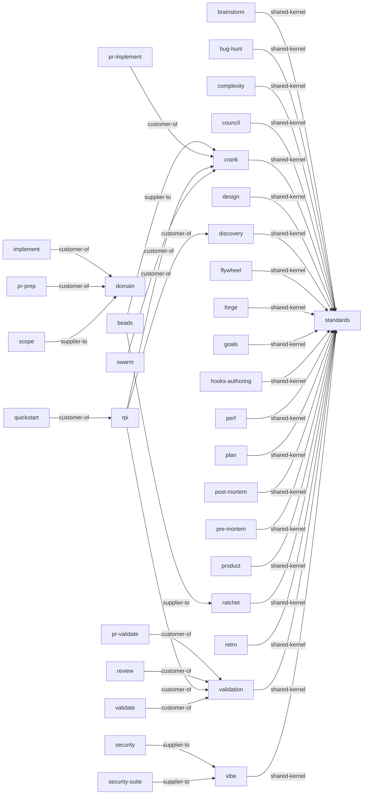

<!-- generated from skills/*/SKILL.md frontmatter -->

# AgentOps Context Map

Generated from SKILL.md frontmatter. See [ADR-0001](https://github.com/boshu2/agentops/blob/main/docs/adr/ADR-0001-ddd-hexagonal-adoption.md)
and [CDLC](https://github.com/boshu2/agentops/blob/main/docs/cdlc.md) for the architectural rationale.

## Skills by hexagonal role

### domain

- `brainstorm` — Separate goals from implementation.
- `bug-hunt` — Investigate bugs and root causes.
- `complexity` — Find focused refactor hotspots.
- `council` — Run multi-judge consensus.
- `crank` — Execute epics through waves.
- `design` — Validate product fit before discovery.
- `discovery` — Create dense execution packets.
- `domain` — Canonical vocabulary for human-AI software work.
- `expert-council` — Alias for /council --mode=debate — adversarial named-persona debate. Triggers: "expert council", "dueling council", "council of <names>". Kept one release.
- `flywheel` — Check knowledge flywheel health.
- `forge` — Mine transcripts into learnings.
- `goals` — Maintain AgentOps goals.
- `hooks-authoring` — Author AgentOps runtime hooks.
- `perf` — Profile and optimize hotspots.
- `plan` — Decompose goals into issue plans.
- `post-mortem` — Review completed work and learn.
- `pre-mortem` — Stress-test plans before work.
- `product` — Create or refine PRODUCT.md.
- `ratchet` — Record Brownian Ratchet gates.
- `retro` — Capture a session learning.
- `shared` — Shared AgentOps skill contracts.
- `standards` — Provide repo coding standards.
- `validation` — Run post-implementation validation.
- `vibe` — Validate code readiness.

### driving-adapter

- `bootstrap` — Initialize AgentOps project files.
- `implement` — Implement one tracked issue.
- `inject` — Load relevant .agents context.
- `pr-implement` — Implement a scoped OSS PR.
- `pr-prep` — Prepare PR commits and body.
- `pr-validate` — Validate PR scope and quality.
- `push` — Validate, commit, and push.
- `quickstart` — Show AgentOps next action.
- `recover` — Recover session context.
- `research` — Explore and write findings.
- `review` — Review diffs for risk, find mocks, scan for bugs, and audit codebases.
- `status` — Show AgentOps work status.
- `validate` — Produce PASS/WARN/FAIL verdicts for artifacts, plans, code, PRs, or gates.

### driven-adapter

- `beads` — Track issues with bd/br, triage with bv, and convert plans to beads.
- `deps` — Audit dependency risks and updates.
- `grafana-platform-dashboard` — Validate OpenShift Grafana dashboards.
- `openai-docs` — Use official OpenAI docs.
- `pr-research` — Research an upstream repo.
- `provenance` — Trace artifact provenance.
- `scope` — Hard-block edits outside declared frozen directories via PreToolUse hook.
- `security` — Run repository security scans.
- `security-suite` — Run composable security analysis.

### supporting

- `autodev` — Manage bounded autonomous dev loops.
- `codex-team` — Coordinate multiple Codex agents.
- `compile` — Compile .agents knowledge wiki.
- `curate` — Mine transcripts, .agents, bd, and git for skill diffs, bd updates, or rare wiki entries.
- `doc` — Generate and validate repo docs.
- `dream` — Run overnight compounding sessions.
- `evolve` — Run autonomous improvement loops.
- `handoff` — Write compact session handoffs.
- `harvest` — Promote .agents knowledge.
- `heal-skill` — Repair skill hygiene.
- `knowledge-activation` — Activate mature .agents knowledge.
- `llm-wiki` — Build external-knowledge wikis.
- `pr-plan` — Plan an open source PR.
- `pr-retro` — Learn from PR outcomes.
- `red-team` — Probe docs and skills.
- `refactor` — Execute safe refactors.
- `release` — Run release validation.
- `reverse-engineer-rpi` — Reverse-engineer product specs.
- `rpi` — Run discovery, crank, validation.
- `scaffold` — Create project, component, or boilerplate scaffolds.
- `scenario` — Manage holdout scenarios.
- `skill-auditor` — Audit an existing SKILL.md against the unified AgentOps template (15 checks). Triggers: "audit skill", "skill quality review", "is this skill ready".
- `skill-builder` — Scaffold or absorb new SKILL.md files against the unified AgentOps template. Triggers: "create a skill", "scaffold skill", "absorb external skill", "new skill".
- `swarm` — Dispatch parallel agents.
- `system-tuning` — Restore system responsiveness via safe, ordered process cleanup and agent-swarm hygiene.
- `test` — Generate tests and coverage plans.
- `trace` — Trace decisions through artifacts.
- `update` — Sync AgentOps skills.

### generic

- `converter` — Convert AgentOps skill formats.
- `oss-docs` — Scaffold or audit OSS docs.
- `readme` — Draft or improve README docs.
- `using-agentops` — Explain AgentOps workflows.

### unclassified

- (no unclassified skills)

## Context relationships

## Data flow (consumes / produces)

| Skill | Direction | Artifact |
|-------|-----------|----------|
| `autodev` | consumes | evolve |
| `autodev` | consumes | rpi |
| `beads` | consumes | bd-issue |
| `beads` | produces | bd-issue |
| `bootstrap` | consumes | goals |
| `bootstrap` | consumes | product |
| `bootstrap` | consumes | readme |
| `bootstrap` | consumes | shared |
| `brainstorm` | consumes | standards |
| `brainstorm` | produces | result.json |
| `brainstorm` | produces | verdict.json |
| `bug-hunt` | consumes | beads |
| `bug-hunt` | consumes | standards |
| `codex-team` | produces | .agents/swarm/results/*.json |
| `complexity` | consumes | doc |
| `complexity` | consumes | standards |
| `complexity` | produces | stdout |
| `converter` | produces | converted-skill |
| `council` | consumes | standards |
| `council` | produces | result.json |
| `council` | produces | verdict.json |
| `crank` | consumes | beads |
| `crank` | consumes | implement |
| `crank` | consumes | post-mortem |
| `crank` | consumes | swarm |
| `crank` | consumes | vibe |
| `crank` | produces | .agents/swarm/results/*.json |
| `crank` | produces | git-changes |
| `curate` | produces | .agents/research/*.md |
| `deps` | produces | result.json |
| `design` | consumes | standards |
| `design` | produces | result.json |
| `discovery` | consumes | brainstorm |
| `discovery` | consumes | design |
| `discovery` | consumes | plan |
| `discovery` | consumes | pre-mortem |
| `discovery` | consumes | research |
| `discovery` | consumes | shared |
| `discovery` | produces | .agents/plans/*.md |
| `discovery` | produces | bd-issue |
| `discovery` | produces | execution-packet.json |
| `doc` | produces | documentation |
| `domain` | produces | stdout |
| `dream` | produces | .agents/research/*.md |
| `flywheel` | produces | .agents/learnings/*.md |
| `forge` | produces | .agents/research/*.md |
| `goals` | produces | result.json |
| `grafana-platform-dashboard` | produces | dashboard-validation-report |
| `handoff` | produces | .agents/research/*.md |
| `harvest` | produces | .agents/research/*.md |
| `hooks-authoring` | produces | result.json |
| `implement` | consumes | domain |
| `implement` | produces | git-changes |
| `llm-wiki` | produces | documentation |
| `openai-docs` | consumes | external-api |
| `oss-docs` | produces | documentation |
| `perf` | produces | result.json |
| `plan` | consumes | standards |
| `plan` | produces | .agents/plans/*.md |
| `plan` | produces | execution-packet.json |
| `post-mortem` | produces | result.json |
| `pr-implement` | consumes | crank |
| `pr-implement` | produces | git-changes |
| `pr-plan` | produces | result.json |
| `pr-prep` | consumes | domain |
| `pr-prep` | produces | git-changes |
| `pr-research` | consumes | external-api |
| `pr-research` | produces | result.json |
| `pr-retro` | produces | .agents/research/*.md |
| `pr-validate` | consumes | validation |
| `pr-validate` | produces | result.json |
| `pre-mortem` | consumes | standards |
| `pre-mortem` | produces | result.json |
| `pre-mortem` | produces | verdict.json |
| `product` | produces | result.json |
| `provenance` | produces | result.json |
| `push` | consumes | git-changes |
| `push` | produces | git-changes |
| `quickstart` | consumes | rpi |
| `quickstart` | produces | stdout |
| `ratchet` | produces | .agents/rpi/*.md |
| `readme` | produces | documentation |
| `recover` | produces | .agents/rpi/*.md |
| `red-team` | produces | result.json |
| `refactor` | produces | git-changes |
| `release` | produces | result.json |
| `research` | consumes | inject |
| `research` | consumes | repo-context |
| `research` | produces | .agents/research/*.md |
| `research` | produces | result.json |
| `retro` | consumes | standards |
| `retro` | produces | result.json |
| `reverse-engineer-rpi` | produces | .agents/research/*.md |
| `review` | consumes | github-pr |
| `review` | consumes | validation |
| `review` | produces | result.json |
| `rpi` | consumes | crank |
| `rpi` | consumes | discovery |
| `rpi` | consumes | domain |
| `rpi` | consumes | ratchet |
| `rpi` | consumes | validation |
| `rpi` | produces | .agents/rpi/*.md |
| `scaffold` | produces | converted-skill |
| `scenario` | produces | result.json |
| `scope` | produces | filesystem-gate |
| `security` | consumes | repo-context |
| `security` | produces | security-report.json |
| `security-suite` | consumes | repo-context |
| `security-suite` | produces | security-report.json |
| `shared` | produces | stdout |
| `skill-auditor` | produces | result.json |
| `skill-builder` | produces | converted-skill |
| `standards` | produces | stdout |
| `status` | produces | stdout |
| `swarm` | consumes | implement |
| `swarm` | consumes | vibe |
| `swarm` | produces | .agents/swarm/results/*.json |
| `test` | produces | result.json |
| `trace` | produces | result.json |
| `using-agentops` | produces | documentation |
| `validate` | consumes | validation |
| `validate` | produces | result.json |
| `validation` | consumes | forge |
| `validation` | consumes | post-mortem |
| `validation` | consumes | retro |
| `validation` | consumes | shared |
| `validation` | consumes | vibe |
| `validation` | produces | .agents/research/*.md |
| `validation` | produces | result.json |
| `validation` | produces | verdict.json |
| `vibe` | consumes | standards |
| `vibe` | produces | result.json |
| `vibe` | produces | verdict.json |
