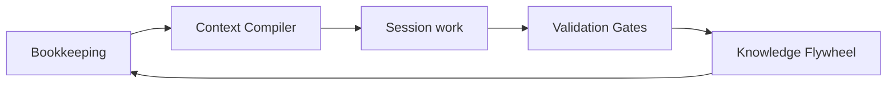

# AgentOps { .landing-hero }

<p class="hero-tagline">
  Software factory for coding agents.<br>
  Keep the books. Compile context. Gate output. Compound knowledge.<br>
  <strong>AI-agent pace with serious-operator discipline.</strong>
</p>

<p class="hero-subtagline">
  Every coding session reads from the corpus on the way in and writes back on the way out — typed, versioned, validated, decay-ranked. Vendor memory follows the chat. The corpus follows the team.
</p>

<p class="hero-actions" markdown>
[:octicons-rocket-24: Install](#install){ .md-button .md-button--primary }
[:octicons-play-24: See It Work](#see-it-work){ .md-button }
[:octicons-mark-github-24: GitHub](https://github.com/boshu2/agentops){ .md-button }
</p>

---

## The Problem

Every agent session starts cold. Same mistakes. Same rework. The landmine in `auth.py`, the two-hour timeout debug, the flag the reviewer always catches — none of it carries forward.

**AgentOps solves this** with four product layers:

| Layer | What it does |
|-------|-------------|
| **Bookkeeping** | Records what agents tried, changed, validated, and learned so the work leaves evidence |
| **Context Compiler** | Assembles the right context for the right phase — decay-ranked, token-budgeted, loaded at session start |
| **Validation Gates** | `/pre-mortem`, `/vibe`, and `/council` challenge plans and code before they ship |
| **Knowledge Flywheel** | Extracts learnings, scores them, and resurfaces them so the next session starts smarter |

Session 1, your agent spends two hours debugging a timeout bug. Session 15, a new agent finds the lesson in seconds because the corpus kept it.



All AgentOps state lives in local `.agents/` — auditable, versionable, yours. Plain text you can grep, diff, review, and exclude from source control. No AgentOps-managed telemetry or hosted control plane; model runtimes, Git remotes, installers, and external tools are operator-selected dependencies. For constrained environments, see the [Assurance Profile](assurance-profile.md).

---

## Install

Pick the runtime you use.

=== "Claude Code"

    ```bash
    claude plugin marketplace add boshu2/agentops
    claude plugin install agentops@agentops-marketplace
    ```

=== "Codex CLI (macOS / Linux / WSL)"

    ```bash
    curl -fsSL https://raw.githubusercontent.com/boshu2/agentops/main/scripts/install-codex.sh | bash
    ```

=== "Codex CLI (Windows PowerShell)"

    ```powershell
    irm https://raw.githubusercontent.com/boshu2/agentops/main/scripts/install-codex.ps1 | iex
    ```

=== "OpenCode"

    ```bash
    curl -fsSL https://raw.githubusercontent.com/boshu2/agentops/main/scripts/install-opencode.sh | bash
    ```

Restart your agent after install, then type `/quickstart` in your agent chat.

The `ao` CLI is optional but recommended. It unlocks repo-native bookkeeping, retrieval, health checks, and terminal workflows.

=== "macOS"

    ```bash
    brew tap boshu2/agentops https://github.com/boshu2/homebrew-agentops
    brew install agentops
    ao version
    ```

=== "Windows PowerShell"

    ```powershell
    irm https://raw.githubusercontent.com/boshu2/agentops/main/scripts/install-ao.ps1 | iex
    ao version
    ```

---

## See It Work

Two commands. Real output.

### Validate a PR with independent judges

```text
> /council validate this PR

[council] 3 judges spawned independently
[judge-1] PASS — token bucket implementation correct
[judge-2] WARN — rate limiting missing on /login endpoint
[judge-3] PASS — Redis integration follows middleware pattern
Consensus: WARN — add rate limiting to /login before shipping
```

### Full loop: research through post-mortem

```text
> /rpi "add retry backoff to rate limiter"

[research]    Found 3 prior learnings on rate limiting
[plan]        2 issues, 1 wave
[pre-mortem]  Council validates the plan
[crank]       Executes the scoped work
[vibe]        Council validates the code
[post-mortem] Captures new learnings in .agents/
[flywheel]    Next session starts with better context
```

The point is not a bigger prompt. The point is a repo that remembers what was tried, what worked, what failed, and what should constrain the next run.

---

## The headline skills

Every skill works alone. Compose flows for end-to-end cycles.

| Skill | Use it when |
|-------|-------------|
| [`/quickstart`](skills/quickstart.md) | You want the fastest setup check and next action |
| [`/council`](skills/council.md) | You want independent judges to review a plan, PR, or decision |
| [`/research`](skills/research.md) | You need codebase context and prior learnings before changing code |
| [`/pre-mortem`](skills/pre-mortem.md) | You want to pressure-test a plan before implementation |
| [`/implement`](skills/implement.md) | You want one scoped task built and validated |
| [`/rpi`](skills/rpi.md) | You want discovery, build, validation, and bookkeeping in one flow |
| [`/vibe`](skills/vibe.md) | You want a code-quality and risk review before shipping |
| [`/evolve`](skills/evolve.md) | You want a goal-driven improvement loop with regression gates |
| [`/dream`](skills/dream.md) | You want overnight knowledge compounding that never mutates source code |

!!! info "Full catalog"
    [:octicons-book-24: **All 70 skills**](skills/catalog.md) — complete reference with source links and descriptions.
    [:octicons-routes-24: **Decision tree**](skills-decision-tree.md) — "which skill do I need next?"

---

## Unsupervised Cycles

**Day: autonomous improvement.** `/evolve` reads `GOALS.md`, fixes the worst fitness gap, runs regression gates, records each cycle.

```text
> /evolve

[evolve] GOALS.md loaded
[cycle-1] Worst gap selected
[rpi]     Implements the fix
[gate]    Tests and quality checks pass
[learn]   Post-mortem feeds the flywheel
```

**Night: knowledge compounding.** `/dream` consolidates learnings, dedupes patterns, defragments the corpus. Purely bookkeeping work over `.agents/` — source code stays untouched, `/rpi` never fires, no git operations.

```text
> /dream start

[overnight] INGEST  harvest new artifacts
[overnight] REDUCE  dedup, defrag, close loops
[overnight] MEASURE corpus quality
[halted]    plateau reached

Morning report: .agents/overnight/<run-id>/summary.md
```

Run Dream overnight, then Evolve in the morning against a fresher corpus. Same model, smarter environment.

---

## Next steps

1. **[Install](#install)** — pick your runtime.
2. **Seed** your repo with `ao quick-start` (`ao quickstart` also works), then run `/quickstart` in your agent chat.
3. **Choose a golden path:** `/rpi "a small goal"` for a first validated change, `/council validate this PR` for review-only, or `bd ready` to continue tracked work.

Read the lineage at [12factoragentops.com](https://12factoragentops.com) — DevOps applied to coding agents in twelve factors.

---

## Explore

<div class="grid cards" markdown>

-   :material-book-open: **[Newcomer Guide](newcomer-guide.md)**

    ---

    Repo orientation, mental model, and a fast path to becoming productive.

-   :material-school: **[Levels L1–L5](levels/index.md)**

    ---

    Progressive learning curriculum from single-session work to full autonomous orchestration.

-   :material-console-line: **[CLI Reference](cli/commands.md)**

    ---

    Every `ao` command, flag, and exit code. Auto-generated on every build.

-   :material-file-tree: **[Architecture](ARCHITECTURE.md)**

    ---

    System design: context compiler, validation gates, knowledge flywheel, RPI pipeline.

-   :material-compare: **[Comparisons](comparisons/README.md)**

    ---

    AgentOps vs Spec-Driven Development, Claude-Flow, Superpowers, Compound Engineer.

-   :material-file-document-multiple: **[Contracts](contracts/index.md)**

    ---

    RPI run registry, finding registry, Dream runs, and every
    other inter-component contract.

</div>

---

<p class="hero-footer" markdown>
Built by the AgentOps contributors. [Philosophy](philosophy.md) · [The Science](the-science.md) · [Strategic Direction](strategic-direction.md)
</p>
