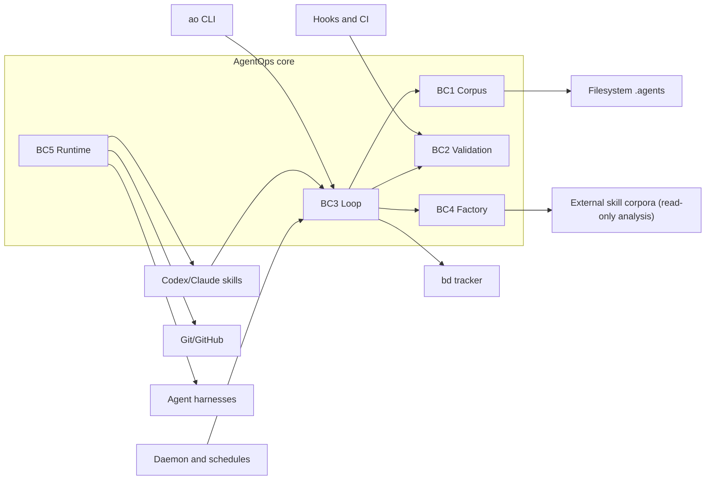

# AgentOps Hexagonal Architecture Map

This document turns the skill-domain audit into an architectural target. It is
not a new architecture; it operationalizes the current `origin/main` direction:
AgentOps is an SDLC control plane and context compiler for LLM agents. The
operating loop is the primitive, and BDD/Gherkin + DDD + Hexagonal Architecture
+ TDD is the narrow waist. XP keeps slices small; CI, SRE, ADRs, provenance,
beads, and ratcheted knowledge make trust repeatable.

## Bounded Contexts

<!-- Generated from docs/contracts/bounded-contexts.yaml — DO NOT EDIT prose; edit yaml and run `bash scripts/check-bounded-contexts-drift.sh` -->

| Context | Core responsibility | Current center of gravity | Ports to make explicit |
|---|---|---|---|
| BC1 Corpus | Capture, retrieve, compile, cite, and promote knowledge. | `.agents/`, `ao corpus`, `compile`, `inject`, `forge`, `harvest`, `dream` | `CorpusReaderPort`, `CorpusWriterPort`, `CitationPort`, `FindingCompilerPort` |
| BC2 Validation | Judge whether plans, code, docs, dependencies, and releases are fit. | `validation`, `vibe`, `council`, gates, evals, CI scripts | `GateRunnerPort`, `CIStatusPort`, `ScenarioRunnerPort`, `EvidenceBinderPort` |
| BC3 Loop | Select work, execute RPI, log cycles, measure fitness, and stop at convergence. | `evolve`, `rpi`, `autodev`, `goals`, `beads`, loop CLI | `LoopReaderPort`, `LoopWriterPort`, `HypothesisLedgerPort`, `ConvergenceCheckPort`, `WorkSelectorPort` |
| BC4 Factory | Build, audit, package, and govern reusable skills and product claims. | `skill-builder`, `skill-auditor`, `heal-skill`, standards, docs | `SkillCatalogPort`, `SkillScorerPort`, `FactoryAdmissionPort`, `ClaimEvidencePort` |
| BC5 Runtime | Adapt the control plane to harnesses, hooks, PRs, shells, and local machines. | Codex/Claude skills, hooks, GitHub PR skills, `push`, `scope`, `swarm` | `HarnessPort`, `OperatorPort`, `EventBusPort`, `GitPort`, `IssueTrackerPort` |

## Hexagonal Rule

Domain policy lives inside the bounded context. Filesystems, GitHub, `bd`,
agent harnesses, shell scripts, external skill corpora, CI, and local machine
state are adapters. Adapters can be swapped; the loop contract cannot.

The core product is therefore not "more skills" or "more hooks." The product is
the alignment layer that turns intent, names, ports, proofs, and memory into
compact executable context for agents.



## Loop Context and `soc-y5vh`

The active bead `soc-y5vh` says the Loop context is not done until the `/evolve`
read path stops relying on direct shell reads and writes for loop decisions.
The current remaining child, `soc-y5vh.8`, requires a bounded `ao loop` surface
or wrapper that uses production `HypothesisLedgerPort` and
`ConvergenceCheckPort` behavior.

The evolution program must therefore treat these as hard architecture rules:

+ Loop cycle selection reads prior failures through typed Corpus/Loop ports.
+ Healing-first mode reads CI status through a typed Validation port.
+ Hypotheses append through a ledger port, not ad hoc JSONL appends.
+ Convergence STOP evaluates through a convergence port, not only a text file.
+ Skill text may describe the loop, but Go ports and tests make it real.

## Adapter Assignment

| Adapter surface | Drives or is driven by | Primary context | Rule |
|---|---|---|---|
| `skills/*/SKILL.md` | Driving adapter | BC3/BC4 | Skills describe operator workflows and must point to executable proof. |
| `skills-codex/*` | Runtime adapter | BC5 | Codex artifacts mirror or tailor source skills; drift is gated. |
| `cli/cmd/ao/*` | Driving adapter | All contexts | CLI commands expose bounded operations, not hidden policy blobs. |
| `cli/internal/ports/*` | Port boundary | All contexts | Ports are narrow interfaces with tests and at least one plausible alternate adapter. |
| `cli/internal/adapters/*` | Driven adapter | Context-specific | Adapters implement ports against filesystem, Git, tracker, CI, or harness state. |
| `hooks/*.sh` | Runtime adapter | BC5/BC2 | Hooks may block or warn, but policy should be traceable to context contracts. |
| `scripts/check-*.sh` and `scripts/validate-*.sh` | Gate adapter | BC2 | Validation scripts should be callable by gates and eventually by `GateRunnerPort`. |
| `.agents/*` | Runtime corpus state | BC1/BC3 | Local-only unless explicitly promoted to durable docs or release artifacts. |

## CLI Orchestration

Codex skills should guide the run, but `ao` should execute the terminal-native
loop. The safe chain is:

```text
agentops-evolution-bootstrap
  -> ao factory start
  -> ao evolve --max-cycles 1 --landing-policy off
  -> ao rpi phased for explicit one-off lifecycles
  -> ao loop history/append/verify for typed BC3 cycle state
  -> /push or explicit git only after validation and authorization
```

If `ao loop` exists in source but not in the installed binary, the runtime
adapter is stale. Update or invoke a source-built CLI from a clean synced
worktree before unattended mode.

## Evolution Guardrails

1. Start every non-trivial item with a Gherkin acceptance row.
2. Map the row to exactly one bounded context.
3. Name the first failing proof before implementation.
4. Keep one slice inside one bounded context unless the architecture map says it
   is an adapter boundary.
5. Keep slices XP-sized: one behavior, one owner, one write scope, one proof.
6. Promote lessons only through the ratchet: handoff, learning, skill/template,
   gate, product/goal doctrine.
7. When a skill, CLI command, and hook all describe the same behavior, the CLI
   or testable script is the proof source; skill prose is the adapter contract.
